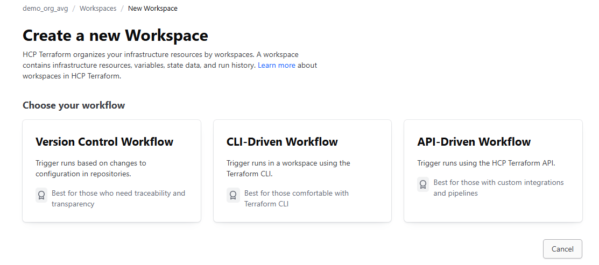
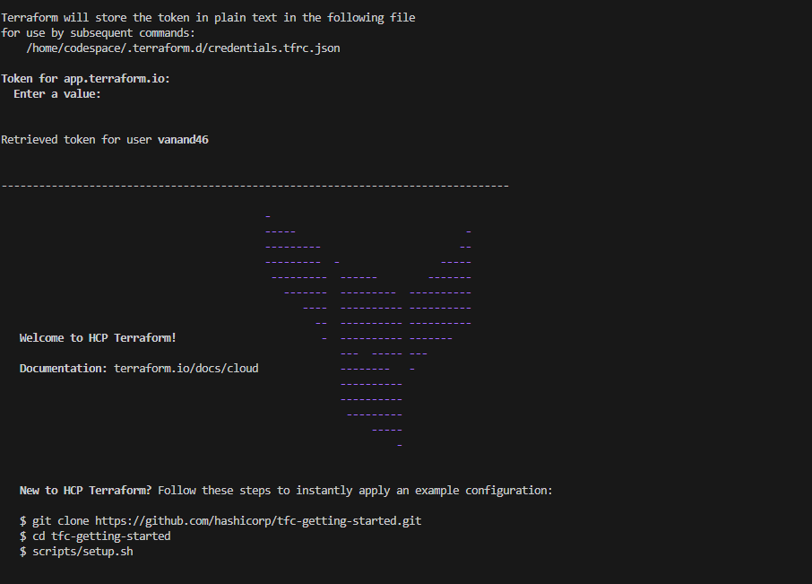
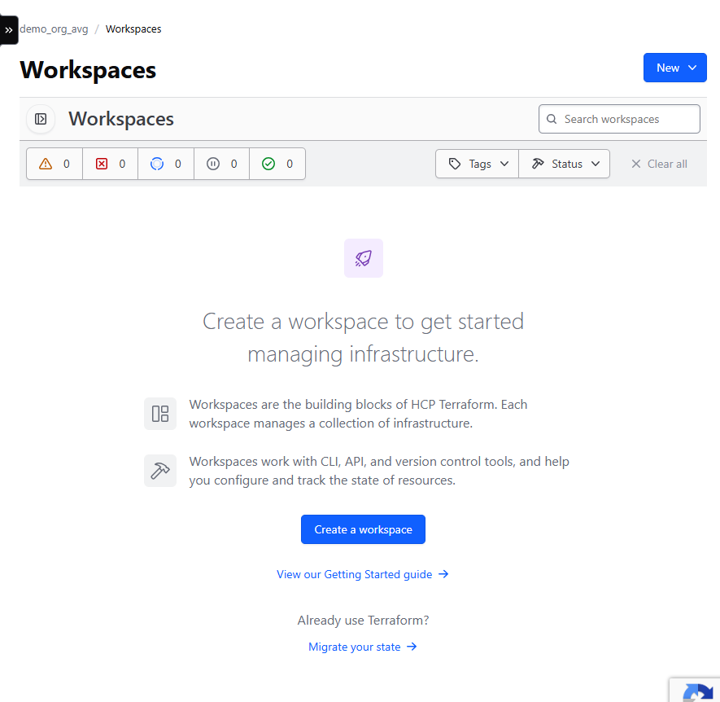
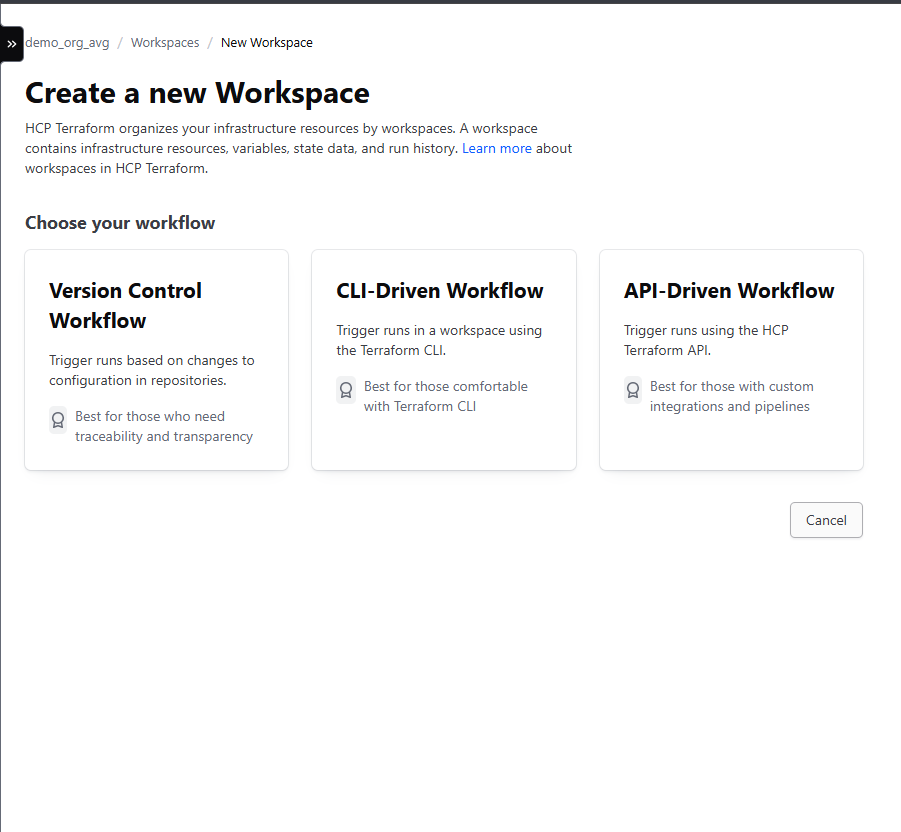
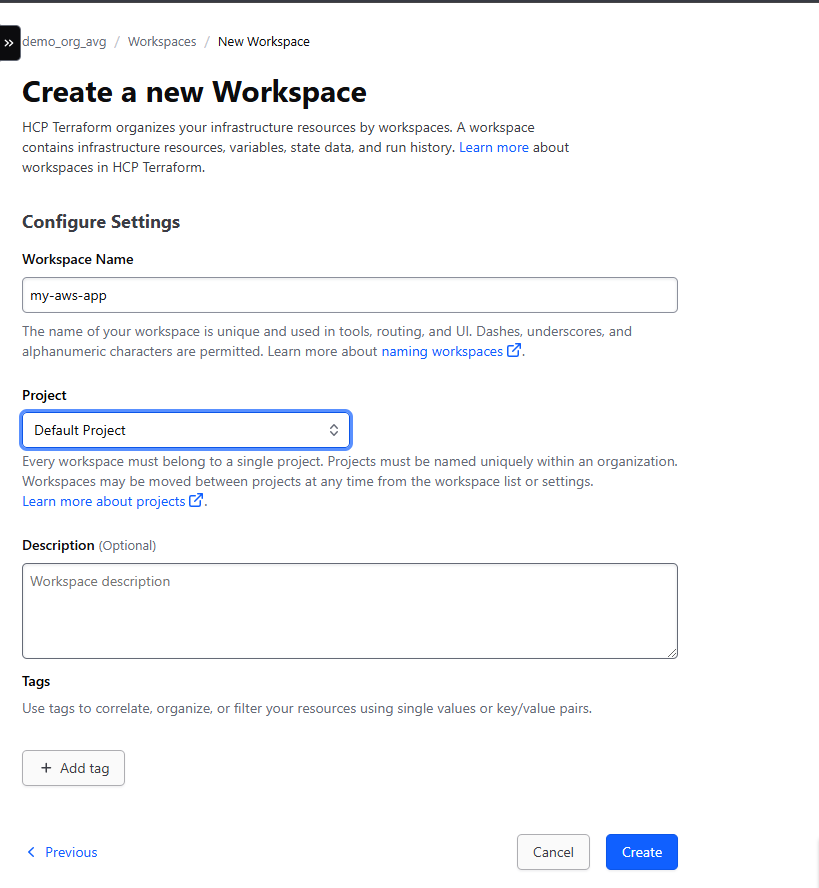
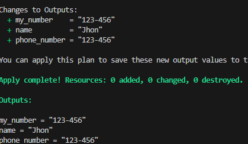
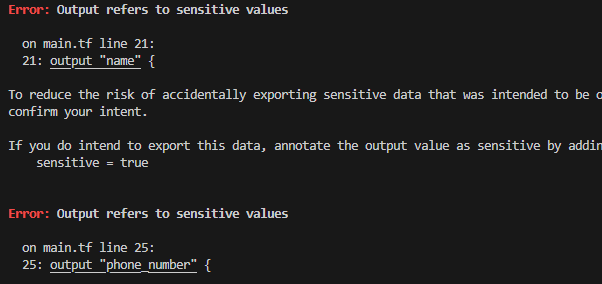
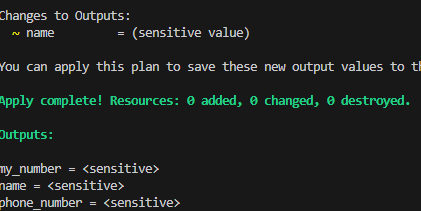
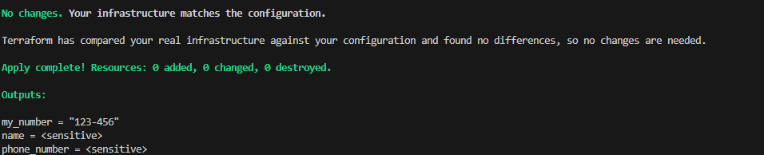

# Configuration Management with Ansible and Terraform 
## Terraform State
- It is a file that tracks the state of infrastructure managed by Terraform.
- It contains the details of all resources along with statuses such as ACTIVE, DELETED, and PROVISIONING.

### Purpose of using the Terraform State
- Acts as a database to map configurations to real-world resources.
- Ensures that each resource in the configuration corresponds to a specific remote object.
- Tracks and manages infrastructure changes.
- Tracks dependencies between resources.
- Speeds up planning and application by caching the attribute values of all resources.
- Reduces the need for querying all resources.

### Core components of Terraform State Files
- version - Version of the state file format.
- terraform_version - Indicates the version of Terraform.
- serial - Auto-increments with every state change.
- outputs - Stores output values defined in the configuration.
- lineage - Unique identifier for state file lineage.
- resources - List of all managed resources.
  - type - Type of the resource.
  - name - Name of the resource.
  - provider - Identifies the provider used for managing the resource.

### Instances in State File
- It provides the current state attributes and dependencies for each resource, ensuring accurate state management.
- Each resource can have multiple instances.
  - attributes
  - dependencies

## Terraform Backends
- Defines where and how Terraform stores state data.
- Configuring a backend to store the state file for user infrastructure is crucial.
- Without a backend, the user will have to manually manage the state file.
- Two types of backends:
  - Local Backend - Stores state file on the local disk, suitable for individual projects.
  - Remote Backend - Stores the state file in a remote, shared store.

## Managing Terraform state using default local backend
```bash
$ mkdir tf_state_local
$ cd tf_state_local
$ nano main.tf
```
```tf
provider "aws" {
  access_key = "your access_key"
  secret_key = "your secret_key"
  region = "us-east-1"
}

resource "aws_s3_bucket" "example" {
    bucket = "demo-bucket-terraform-state-avg"
}
```
```bash
$ terraform init
$ terraform validate
$ terraform plan
$ terraform apply -auto-approve
## Check S3 to verify whether the bucket has been created or not.
$ cat terraform.tfstate
$ nano terraform.tf
```
```tf
terraform {
  backend "s3" {
    bucket = "demo-bucket-terraform-state-avg"
    key = "prod/aws_infra"
    region = "us-east-1"
  }
}
```
```bash
$ terraform init ## Will throw an error because credentials are missing.
$ terraform init -backend-config="access_key=''" -backend-config="secret_key=''"
## Check S3 to verify whether the bucket has a folder created under prod/aws_infra or not.
$ terraform validate
$ terraform plan
$ terraform apply -auto-approve
## Check S3 to verify whether the tfstate file has been created under prod/aws_infra or not.
$ cat terraform.tfstate ## It will be empty as the state file has moved to S3.
$ terraform destroy -auto-approve # Will throw an error as the S3 Bucket is not empty.
```

## https://app.terraform.io/ Examples

- Create an Organization (Name: demo_org_avg)

- Authenticate Terraform account.
- Generate a Terraform Cloud/Enterprise API Token and copy it.
```bash
$ terraform login ## Paste the API token.
```


## State Locking

- It is a mechanism to prevent concurrent operations on the same state file to avoid conflicts and potential corruption.
- Ensures:
  - Consistency
  - Integrity
  - Reliability
  - Safety

### State Locking Steps
- Define the backend configuration.
- Specify the necessary parameters for state locking such as DynamoDB table for AWS S3.
- Azure Blob Storage and Google Cloud Storage can automatically handle the state locking.

### Implement State Locking using Terraform in AWS
```bash
$ mkdir s3-dynamodb-state
$ cd s3-dynamodb-state
## Create two configuration files (s3.tf and dynamo.tf)
$ nano s3.tf
```
```tf
provider "aws" {
  access_key = "YOUR_AWS_ACCESS_KEY"
  secret_key = "YOUR_AWS_SECRET_KEY"
  region = "us-east-1"
}

resource "aws_s3_bucket" "backend" {
    bucket = "myterraformstatedemo-00-backend-avg"
    tags = {
        Name = "S3 Remote Terraform State Store"
    }
}

resource "aws_s3_bucket_versioning" "enable_versioning" {
  bucket = aws_s3_bucket.backend.id
  versioning_configuration {
    status = "Enabled"
  }
}

resource "aws_s3_bucket_server_side_encryption_configuration" "s3_encryption" {
  bucket = aws_s3_bucket.backend.id

  rule {
    apply_server_side_encryption_by_default {
      sse_algorithm     = "AES256"
    }
  }
}

resource "aws_s3_bucket_object_lock_configuration" "s3_lock" {
  bucket = aws_s3_bucket.backend.id
  object_lock_enabled = "Enabled"
  depends_on = [aws_s3_bucket_versioning.enable_versioning]
}

output "s3_bucket_id" {
  value = aws_s3_bucket.backend.id
}
```
```bash
 $nano dynamo.tf
```
```tf
resource "aws_dynamodb_table" "terraform-lock" {
    name           = "terraform_state"
    read_capacity  = 5
    write_capacity = 5
    hash_key       = "LockID"
    attribute {
        name = "LockID"
        type = "S"
    }
    tags = {
        "Name" = "DynamoDB Terraform State Lock Table"
    }
}
```
```bash
$ terraform init
$ terraform validate
$ terraform plan
$ terraform apply -auto-approve
$ nano main.tf
```
```tf
terraform {
  backend "s3" {
    bucket         = "myterraformstatedemo-00-backend-avg"
    key            = "terraform.tfstate"
    region         = "us-east-1"
    dynamodb_table = "terraform_state"
  }
}
```
```bash
$ terraform init -backend-config="access_key=YOUR_AWS_ACCESS_KEY"  -backend-config="secret_key=YOUR_AWS_SECRET_KEY"
$ terraform apply -auto-approve
```
## Migrate the state file to terraform cloud:
- Login to https://app.terraform.io/ 
- Click on your Organization
- Create workspace > CLI Driven Workflow
  - Workspace name: my-aws-app
  - Create
```bash
$ nano main.tf
```
```tf
terraform {
  backend "remote" {
    hostname = "app.terraform.io"
    organization = "demo_org_avg"

    workspaces { 
      name = "my-aws-app" 
    } 
  }
}
```
```bash
$ terraform validate
$ terraform init -migrate-state
```




## Handling Sensitive Data in Terraform State
- Refers to information that needs protection due to its confidential nature.
- Includes database passwords, private keys, and other credentials.

### Recommendations for Handling Sensitive Data
- Treat state as sensitive data (it contains all infrastructure information).
- Use a remote backend (provides better security like encryption).
- Verify backend configurations.

## Managing sensitive data in Terraform state
```bash
$ mkdir sensitive_tf
$ cd sensitive_tf
$ nano main.tf
```
```tf
variable "name" {
  type = string
  sensitive = true
  default = "John"
}

variable "phone" {
  type = string
  sensitive = true
  default = "123-456"
}
```

```bash
$ terraform validate
$ terraform apply -auto-approve
```


```bash
$ nano main.tf
```
```tf
output "name" {
  value = local.contact_info.name
  sensitive = true
}

output "phone_number" {
  value = local.contact_info.phone
  sensitive = true
}

output "my_number" {
  value = local.my_number
  sensitive = true
}
```

```bash
$ terraform validate
$ terraform apply -auto-approve
```

