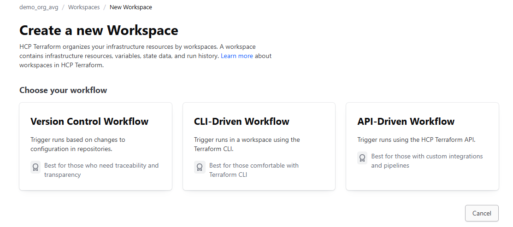
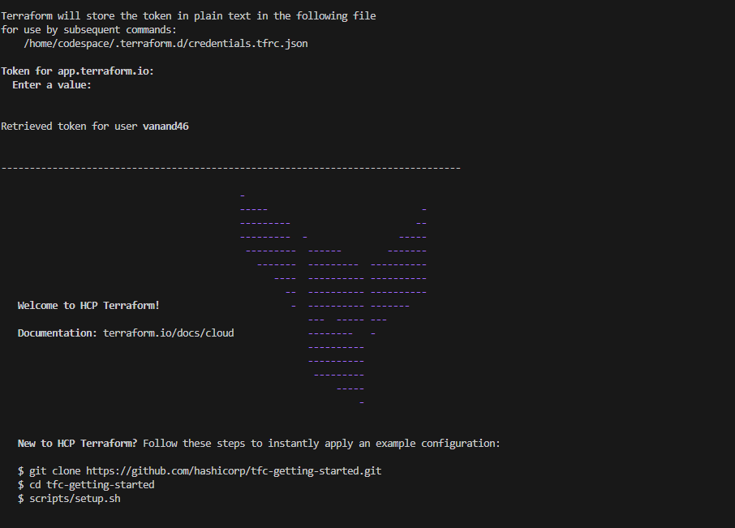
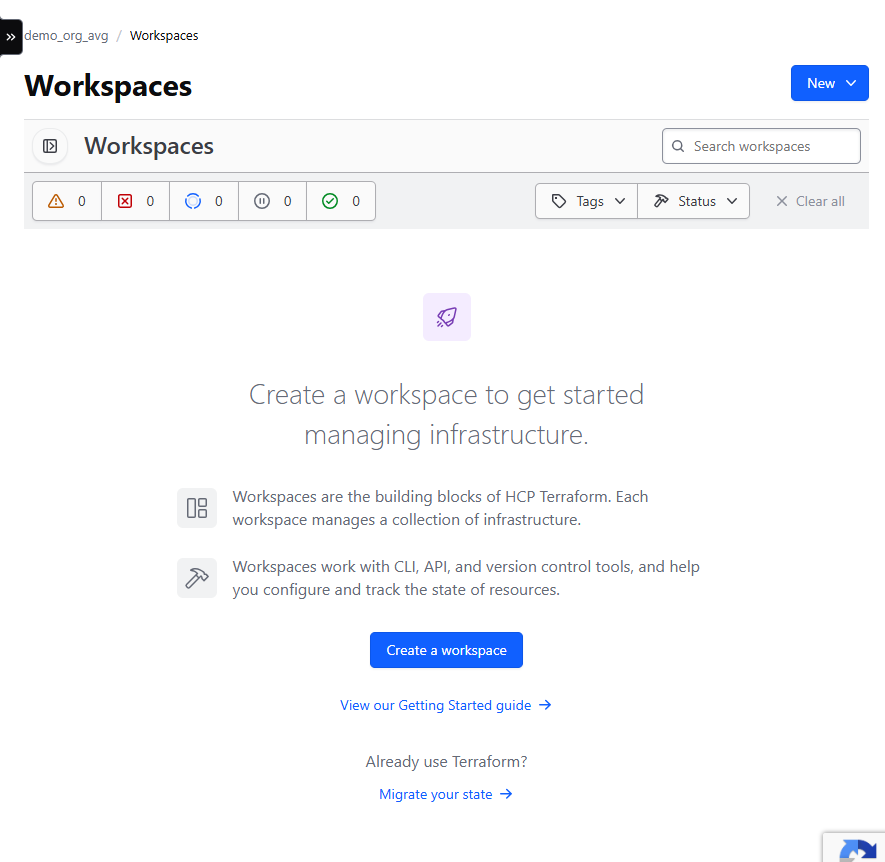
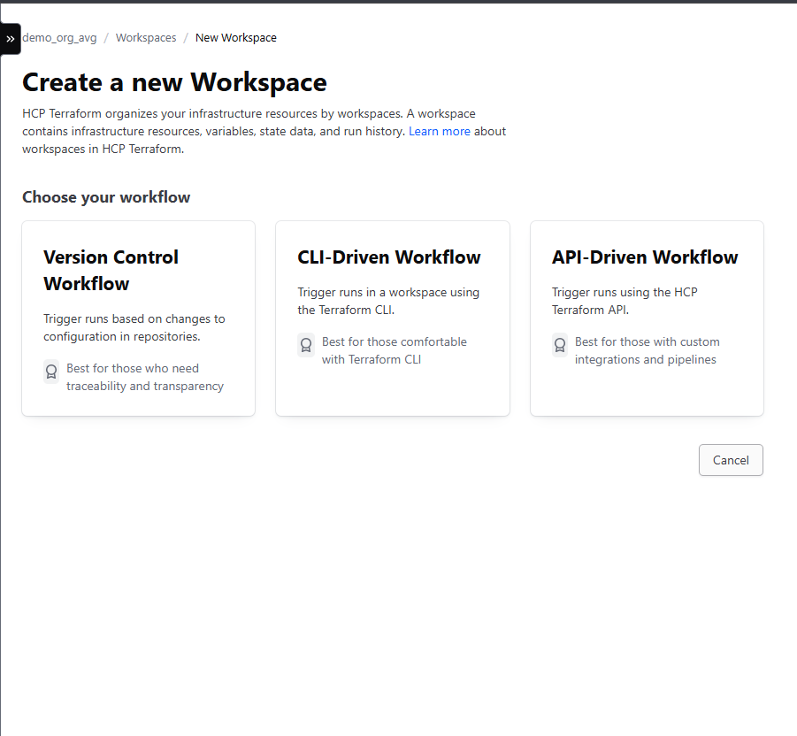
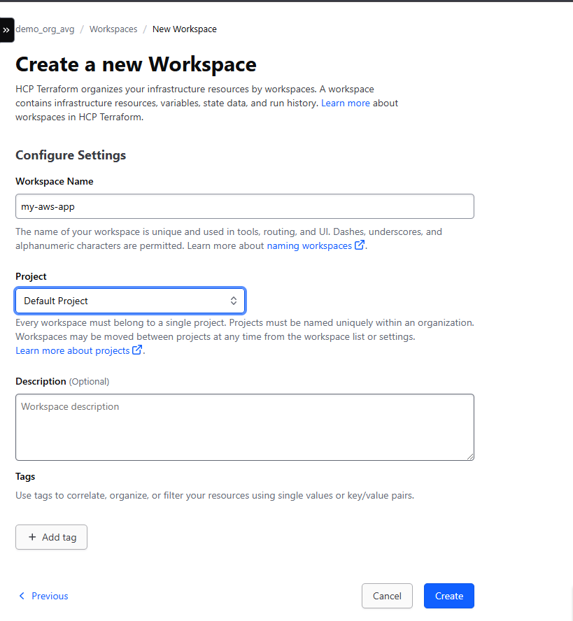
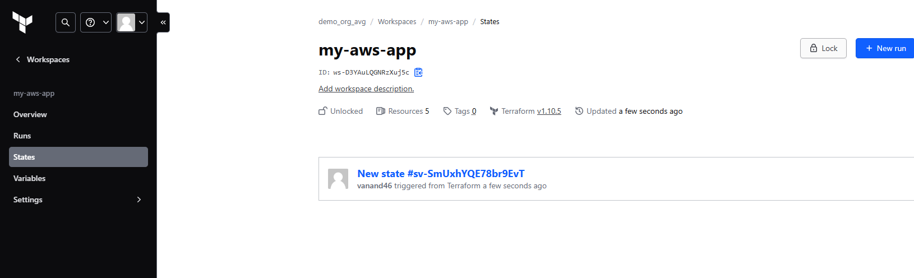

# Configuration Management with Ansible and Terraform – 09 February 2025  
## Terraform State
- It is a file that tracks the state of infrastructure managed by Terraform.
- It contains the details of all resources along with status such as ACTIVE, DELETED and PROVISIONING

### Purpose of using the Terraform State
- Act as database to map configurations to real-world resources.
- Ensures that each resource in the configuration corresponds to a specific remote object.
- Tracking and management of infrastructure changes.
- Tracks dependencies between resources.
- Planning and application speeding by caching the attribute values of all resources.
- Reduces the need for querying all resources.

### Core components of Terraform State Files
- version - Version of the state file format
- terraform_version - Indicates the version of terraform
- serial - auto_increment with every state change
- outputs - stores output values defined in the Configuration
- lineage - Unique identifier for state file lineage
- resources - List of all managed resources
  - type - type of the resource
  - name - name of the resource
  - provider - identifies the provider used for managing the resource
### Instances in State File
- It provides the current state attributes and dependencies for each resource ensuring accurate state management.
- Each resource can have multiple instances
  - attributes
  - dependencies
## Terraform Backends
- It defines where and how Terraform stores state data.
- Configuring a backend to store the state file for user infrastructure is crucial
- Without a backend , the user will have to manually manage the state file.
- Two types of back end
  - Local Backend - stores state file on the local disk.suitable for individual project
  - Remote Backend - stores the state file in a remote , shared store.
 ## Managing Terraform state using default local backend 
```bash
$mkdir tf_state_local
$cd tf_state_local
$nano main.tf
```
```tf
provider "aws" {
  access_key = "your access_key"
  secret_key = "your secret_key"
  region = "us-east-1"
}

resource "aws_s3_bucket" "example" {
    bucket = "demo-bucket-terraform-state-avg"
}
```
```bash
$ terraform init
$ terraform validate
$ terraform plan
$ terraform apply -auto-approve
## check s3 to check whether bucket has created or not
$ cat terraform.tfstate
$nano terraform.tf
```
```tf
terraform {
  backend "s3" {
    bucket = "demo-bucket-terraform-state-avg"
    key = "prod/aws_infra"
    region = "us-east-1"
  }
}
```
```bash
$ terraform init ## will throw an error because credentials are missing
$ terraform init -backend-config="access_key=''" -backend-config="secret_key=''"
## check s3 to check whether bucket has folder created prod/aws_infra or not
$ terraform validate
$ terraform plan
$ terraform apply -auto-approve
## check s3 to check whether bucket has tfstate file created under prod/aws_infra or not
$ cat terraform.tfstate ## it will be empty as state file moved to s3
$ terraform destroy -auto-approve # will throw error deleting S3 Bucket is not empty
```

## https://app.terraform.io/ Examples

- Create an Organization (Name: demo_org_avg)

- Authenticate Terraform account
- Generate a Terraform Cloud/Enterprise API Token and copy it
```bash
$terraform login ##paste the api token
```


## State Locking

- It is mechanism to prevent concurrent operations on the same state file to avoid conflicts and potential corruption.
- Consistency
- Integrity
- Reliability
- Safety

### State Locking Steps
- Define the backend configuration
- Specify the necessary parameters for state locking such as DynamoDB table for AWS S3
- Azure Blob Storage and Google Cloud Storage can automatically handle the state locking.

### Implement State Locking using Terraform in AWS
```bash
$mkdir s3-dynamodb-state
$cd s3-dynamodb-state
## create two configurations files(s3.tf and dynamo.tf)
$nano s3.tf
```
```tf
provider "aws" {
  access_key = "YOUR_AWS_ACCESS_KEY"
  secret_key = "YOUR_AWS_SECRET_KEY"
  region = "us-east-1"
}

resource "aws_s3_bucket" "backend" {
    bucket = "myterraformstatedemo-00-backend-avg"
    tags = {
        Name = "S3 Remote Terraform State Store"
    }
}

resource "aws_s3_bucket_versioning" "enable_versioning" {
  bucket = aws_s3_bucket.backend.id
  versioning_configuration {
    status = "Enabled"
  }
}

resource "aws_s3_bucket_server_side_encryption_configuration" "s3_encryption" {
  bucket = aws_s3_bucket.backend.id

  rule {
    apply_server_side_encryption_by_default {
      sse_algorithm     = "AES256"
    }
  }
}

resource "aws_s3_bucket_object_lock_configuration" "s3_lock" {
  bucket = aws_s3_bucket.backend.id
  object_lock_enabled = "Enabled"
  depends_on = [aws_s3_bucket_versioning.enable_versioning]
}

output "s3_bucket_id" {
  value = aws_s3_bucket.backend.id
}

```
```bash
$nano dynamo.tf
```
```tf
resource "aws_dynamodb_table" "terraform-lock" {
    name           = "terraform_state"
    read_capacity  = 5
    write_capacity = 5
    hash_key       = "LockID"
    attribute {
        name = "LockID"
        type = "S"
    }
    tags = {
        "Name" = "DynamoDB Terraform State Lock Table"
    }
}
```
```bash
$ terraform init
$ terraform validate
$ terraform plan
$ terraform apply -auto-approve
## Please check all the aws resources are created or not.
$ nano main.tf
```
```tf
terraform {
  backend "s3" {
    bucket         = "myterraformstatedemo-00-backend-avg"
    key            = "terraform.tfstate"
    region         = "us-east-1"
    dynamodb_table = "terraform_state"
  }
}
```
```bash
$ terraform init -backend-config="access_key='YOUR_AWS_ACCESS_KEY'"  -backend-config="secret_key='YOUR_AWS_SECRET_KEY'" 
$ terraform apply -auto-approve
```
## Implementing State Migration
- Improved scalability
- Enhanced security
- Centralized management
### Where to use migration
- Local to remote backend
- Reorganizing resources
- Changing cloud providers
### Ways to Migrate Terraform State
- Using terraform init command
- Manually copy the state files
- Using terraform state commands
- Verify the migration with terraform plan
- Update terraform configurations

## Migrate the state file to terraform cloud
- Login to https://app.terraform.io/ 
- Click on your Organization
- Create workspace > CLI Driven Workflow
  - Workspace name: my-aws-app
  - Create
 



```bash
$ cd s3-dynamodb-state
$ nano main.tf
```
```tf
terraform {
  backend "remote" {
    hostname = "app.terraform.io"
    organization = "YOUR_ORG_NAME" 

    workspaces { 
      name = "my-aws-app" 
    } 
  }
}
```
```bash
$ terraform validate
$ terraform init -migrate-state
```


